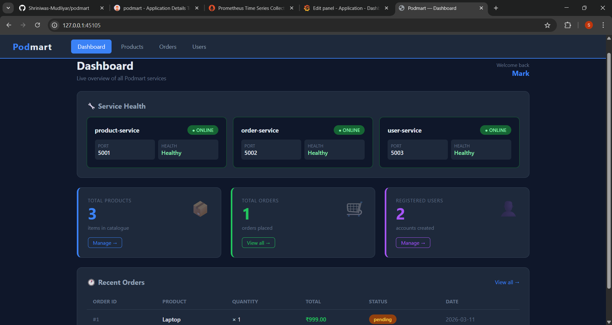
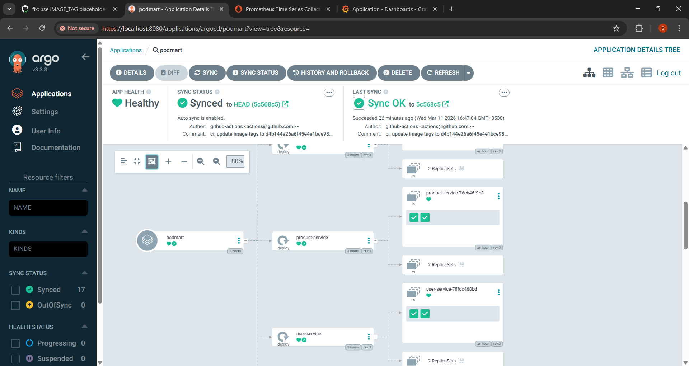
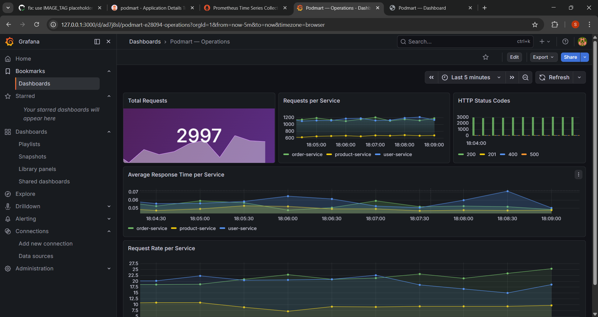
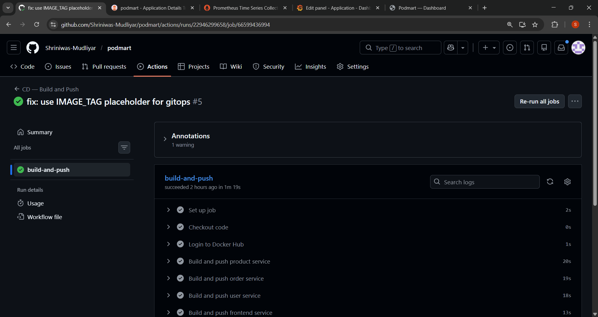

<div align="center">

# 🛒 Podmart

### Production-Grade Microservices Platform with Full DevOps Pipeline

[](https://kubernetes.io)
[](https://docker.com)
[](https://terraform.io)
[](https://github.com/features/actions)
[](https://prometheus.io)
[](https://grafana.com)
[](https://argoproj.github.io)
[](https://python.org)

</div>

---

## 📌 Overview

Podmart is a cloud-native microservices e-commerce platform built to demonstrate a complete end-to-end DevOps workflow. The application simulates a real online store with independent services for products, orders, and users — each with its own database, containerized with Docker, orchestrated by Kubernetes, and monitored with Prometheus and Grafana.

> The app is intentionally simple. The infrastructure is the point.

---

## 🏗️ Architecture

```
                         ┌─────────────────────────────────────────┐
                         │           Kubernetes (Minikube)          │
                         │                                          │
                         │   ┌─────────────┐                       │
         Browser ───────────▶│   Frontend  │                       │
                         │   │  Service    │                       │
                         │   └──────┬──────┘                       │
                         │          │                               │
                    ┌────┴────┬─────┴────┐                         │
                    │         │          │                          │
             ┌──────▼──┐ ┌───▼─────┐ ┌──▼──────┐                  │
             │ Product │ │  Order  │ │  User   │                   │
             │ Service │ │ Service │ │ Service │                   │
             └──────┬──┘ └───┬─────┘ └──┬──────┘                  │
                    │        │           │                          │
             ┌──────▼──┐ ┌───▼─────┐ ┌──▼──────┐                  │
             │Product  │ │ Order   │ │  User   │                   │
             │   DB    │ │   DB    │ │   DB    │                   │
             └─────────┘ └─────────┘ └─────────┘                  │
                                                                    │
                    ┌───────────────────────────┐                  │
                    │    Monitoring Namespace    │                  │
                    │  Prometheus │   Grafana    │                  │
                    │       Alertmanager         │                  │
                    └───────────────────────────┘                  │
                         └─────────────────────────────────────────┘
```

---

## 🚀 Tech Stack

| Layer | Technology |
|---|---|
| **Application** | Python, Flask, SQLAlchemy |
| **Database** | PostgreSQL (database-per-service pattern) |
| **Containerization** | Docker, Docker Compose |
| **Orchestration** | Kubernetes (Minikube) |
| **GitOps** | ArgoCD |
| **CI/CD** | GitHub Actions |
| **Image Registry** | Docker Hub |
| **Monitoring** | Prometheus, Grafana, Alertmanager |
| **Infrastructure as Code** | Terraform (AWS S3, IAM) |
| **Package Manager** | Helm |

---

## 📦 Services

| Service | Port | Description |
|---|---|---|
| `frontend-service` | 5000 | Web UI — dashboard, products, orders, users |
| `product-service` | 5001 | Product catalogue management |
| `order-service` | 5002 | Order processing, talks to product-service |
| `user-service` | 5003 | User registration and authentication |

Each service exposes a `/health` endpoint and a `/metrics` endpoint scraped by Prometheus.

---

## 🔄 CI/CD Pipeline

```
Developer pushes code
        │
        ▼
GitHub Actions triggers
        │
        ├── CI (on Pull Request)
        │   ├── Run pytest
        │   ├── Lint Dockerfiles (hadolint)
        │   └── Validate K8s manifests
        │
        └── CD (on merge to main)
            ├── Build Docker images
            ├── Tag with Git SHA
            ├── Push to Docker Hub
            ├── Update image tags in K8s YAML
            ├── Commit updated manifests to GitHub
            └── ArgoCD detects change → deploys to Kubernetes
```

---

## 🔁 GitOps with ArgoCD

ArgoCD watches this repository every 3 minutes. When the CD pipeline updates the image tags in the Kubernetes manifests, ArgoCD detects the change and automatically syncs the cluster to match the desired state in Git.

- **Self-healing** — if someone manually changes the cluster, ArgoCD corrects it
- **Drift detection** — cluster always matches what's in Git
- **Rollback** — revert a Git commit to roll back a deployment

---

## 📊 Observability

### Prometheus Metrics
Each Flask service exposes custom business metrics:

| Metric | Type | Description |
|---|---|---|
| `orders_total` | Counter | Total orders placed |
| `order_value_dollars` | Histogram | Order value distribution |
| `registered_users_total` | Counter | Total registered users |
| `login_attempts_total` | Counter | Login attempts by status |
| `flask_http_request_total` | Counter | HTTP requests per service |
| `flask_http_request_duration_seconds` | Histogram | Request latency |

### Grafana Dashboards
- **Service Health** — request rate, error rate, p99 latency per service
- **Business Metrics** — orders per minute, revenue, user registrations
- **Infrastructure** — pod CPU/memory, node utilization

---

## 📁 Project Structure

```
podmart/
├── services/
│   ├── product-service/        # Flask app + Dockerfile
│   ├── order-service/          # Flask app + Dockerfile
│   ├── user-service/           # Flask app + Dockerfile
│   └── frontend-service/       # Flask app + HTML templates
├── k8s/
│   ├── namespaces/             # podmart namespace
│   ├── configmaps/             # app config + secrets example
│   ├── deployments/            # service + db deployments
│   ├── services/               # ClusterIP + NodePort services
│   ├── ingress/                # ingress rules
│   ├── argocd/                 # ArgoCD Application manifest
│   └── monitoring/             # ServiceMonitor for Prometheus
├── terraform/                  # AWS S3 + IAM infrastructure
│   ├── main.tf                 # S3 bucket + IAM user + policy
│   ├── variables.tf
│   ├── outputs.tf
│   └── versions.tf
├── .github/workflows/
│   ├── ci.yml                  # runs tests + linting on PRs
│   └── cd.yml                  # builds, pushes, updates manifests
└── docker-compose.yml          # local development
```

---

## 🛠️ Running Locally

### Prerequisites
- Docker
- Docker Compose

```bash
git clone https://github.com/Shriniwas-Mudliyar/podmart.git
cd podmart
docker compose up --build
```

Open `http://localhost:5000`

---

## ☸️ Running on Kubernetes

### Prerequisites
- Minikube
- kubectl
- Helm

### 1 — Start Minikube

```bash
minikube start --driver=docker --cpus=2 --memory=3000
```

### 2 — Create Namespaces

```bash
kubectl create namespace podmart
kubectl create namespace monitoring
```

### 3 — Configure Secrets

```bash
# Copy the example secrets file and fill in your values
cp k8s/configmaps/podmart-secrets.example.yaml k8s/configmaps/podmart-secrets.yaml
# Edit the file with your actual credentials
```

### 4 — Deploy Application

```bash
# Apply all manifests recursively
kubectl apply -R -f k8s/ -n podmart
```

### 5 — Access the App

```bash
minikube service frontend-service -n podmart --url
```

---

## 📈 Install Monitoring Stack

```bash
helm repo add prometheus-community https://prometheus-community.github.io/helm-charts
helm repo update
helm install monitoring prometheus-community/kube-prometheus-stack \
  --namespace monitoring

# Get Grafana admin password
kubectl get secret -n monitoring monitoring-grafana \
  -o jsonpath="{.data.admin-password}" | base64 -d && echo

# Apply ServiceMonitors (after Helm install completes)
kubectl apply -f k8s/monitoring/servicemonitor.yaml

# Access Grafana at http://localhost:3000
kubectl port-forward svc/monitoring-grafana -n monitoring 3000:80
```

### Access Prometheus

```bash
# Access Prometheus at http://localhost:9090
kubectl port-forward svc/monitoring-kube-prometheus-prometheus -n monitoring 9090:9090
```

---

## 🔀 Install ArgoCD

```bash
kubectl create namespace argocd
kubectl apply -n argocd \
  -f https://raw.githubusercontent.com/argoproj/argo-cd/stable/manifests/install.yaml

# Wait for pods to be ready
kubectl wait --for=condition=Ready pods --all -n argocd --timeout=120s

# Apply the ArgoCD Application manifest (points ArgoCD at this repo)
kubectl apply -f k8s/argocd/podmart-app.yaml

# Get admin password
kubectl -n argocd get secret argocd-initial-admin-secret \
  -o jsonpath="{.data.password}" | base64 -d && echo

# Access ArgoCD UI at https://localhost:8080 (username: admin)
kubectl port-forward svc/argocd-server -n argocd 8080:443
```

---

## 🌍 Terraform — AWS Infrastructure

Provisions the S3 remote state bucket and IAM deploy user for CI/CD.

### Prerequisites
- Terraform >= 1.0
- AWS CLI configured (`aws configure`)

```bash
cd terraform

# Initialise providers
terraform init

# Preview changes
terraform plan

# Apply infrastructure
terraform apply
```

### Resources Created

| Resource | Name | Purpose |
|---|---|---|
| `aws_s3_bucket` | `podmart-tf-state-061785` | Remote state storage |
| `aws_s3_bucket_versioning` | enabled | State file history |
| `aws_s3_bucket_server_side_encryption_configuration` | AES256 | Encryption at rest |
| `aws_s3_bucket_public_access_block` | all blocked | Security |
| `aws_iam_user` | `podmart-deploy` | CI/CD deploy user |
| `aws_iam_policy` | `podmart-deploy-policy` | Scoped S3 + ECR + EKS permissions |
| `aws_iam_access_key` | — | Programmatic credentials |

### After Apply — Add to GitHub Secrets

```bash
# Get the secret access key
terraform output -raw iam_secret_access_key
```

Add these to **GitHub → Settings → Secrets → Actions**:

| Secret | Value |
|---|---|
| `AWS_ACCESS_KEY_ID` | from `terraform output iam_access_key_id` |
| `AWS_SECRET_ACCESS_KEY` | from `terraform output -raw iam_secret_access_key` |
| `DOCKER_USERNAME` | your Docker Hub username |
| `DOCKER_PASSWORD` | your Docker Hub password |

---

## 🔑 Key DevOps Concepts Demonstrated

- **Microservices** — database-per-service pattern, fault isolation
- **Containerization** — Docker images tagged with Git SHA for full traceability
- **Kubernetes** — Deployments, StatefulSets, Services, ConfigMaps, Secrets, resource limits, liveness/readiness probes
- **GitOps** — ArgoCD watches Git as single source of truth with auto self-heal and prune
- **CI/CD** — automated build, push, and manifest update on every commit to main
- **Observability** — custom Prometheus metrics, Grafana dashboards, Alertmanager, ServiceMonitors
- **Infrastructure as Code** — Terraform for AWS S3 + IAM with remote state
- **Security** — secrets excluded from Git, S3 bucket encrypted + public access blocked, IAM policy least privilege

---

## 📸 Screenshots

### Podmart Dashboard


### ArgoCD — GitOps View


### Grafana — Service Health


### GitHub Actions — CI/CD Pipeline


---

## 👨‍💻 Author

**Shriniwas Mudliyar**
- GitHub: [@Shriniwas-Mudliyar](https://github.com/Shriniwas-Mudliyar)
- LinkedIn: [linkedin.com/in/shriniwas-mudliyar](https://linkedin.com/in/shriniwas-mudliyar)

---

<div align="center">
Built with ❤️ to demonstrate production-grade DevOps practices
</div>
